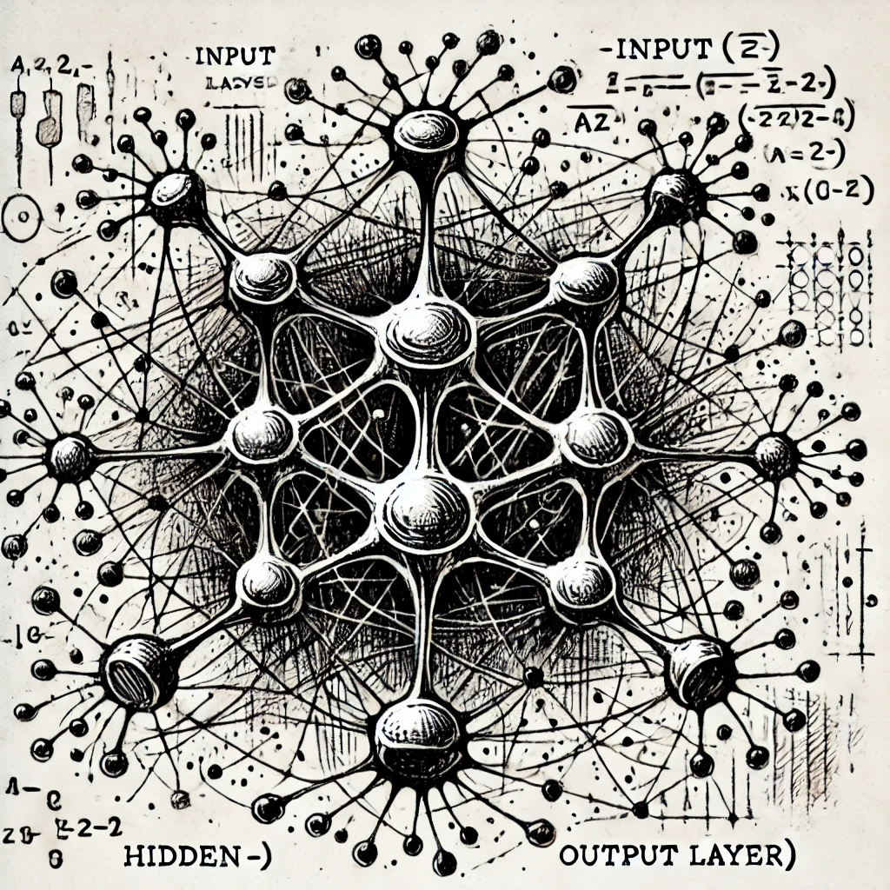

<h1 align="center">👋 Hi, I'm Abhijeet — AI/ML Engineer & MLOps Practitioner</h1>

  Passionate about building intelligent systems, scalable ML pipelines, and AI products that solve real problems.

---

## 🚀 About Me

- 🤖 **AI/ML Engineer & Data Scientist**  
- ☁️ Skilled in **MLOps**, cloud ML deployments (AWS | Azure), and model optimization  
- 🧠 Love working with **LLMs, NLP, Generative AI, Computer Vision**  
- 🌱 Currently learning **Advanced AI, LLMOps, microservices, and Java Full Stack**  
- ⚡ Fun fact: I'm addicted to automating things that shouldn't need automation 😄  
- 🤝 Always open to collaborations on **AI, ML, and cloud-native ML systems**

---

## 🧠 Tech Stack & Tools

### **Languages & Core**

  

### **Machine Learning & Deep Learning**

  

### **MLOps / Cloud / DevOps**

  

### **Databases**

  

---

## 📊 GitHub Analytics

  

  
  

---

## 🏆 GitHub Achievements

  

---

## 🚀 Highlight Projects

Here are some AI/ML + MLOps projects you can add as you upload them:

### 🔹 **1. End-to-End MLOps Pipeline (CI/CD + Model Deployment)**
- Trained ML model → automated testing → Dockerization → cloud deployment  
- Tools: **FastAPI, Docker, GitHub Actions, AWS ECR/ECS**

### 🔹 **2. LLM Chatbot with Retrieval Augmented Generation (RAG)**
- Custom embeddings, vector DB search, LLM inference  
- Tools: **HuggingFace, FAISS, LangChain**

### 🔹 **3. Real-Time Computer Vision App**
- Object detection + tracking  
- Tools: **YOLOv8, OpenCV, PyTorch**

### 🔹 **4. Customer Churn Prediction Pipeline**
- Feature store → model registry → batch/real-time inference  
- Tools: **MLflow, Airflow, AWS SageMaker**

👉 Want me to generate full project descriptions + folder structures? Just say **“Generate project templates”**.

---

## 📫 Connect With Me

  
  

---

## 👾 Fun Contribution Mode

<picture>
  <source media="(prefers-color-scheme: dark)" srcset="https://raw.githubusercontent.com/abhijeet-chauhan/abhijeet-chauhan/output/pacman-contribution-graph-dark.svg">
  <source media="(prefers-color-scheme: light)" srcset="https://raw.githubusercontent.com/abhijeet-chauhan/abhijeet-chauhan/output/pacman-contribution-graph.svg">
  
</picture>

---

## 👀 Profile Views

  

---
